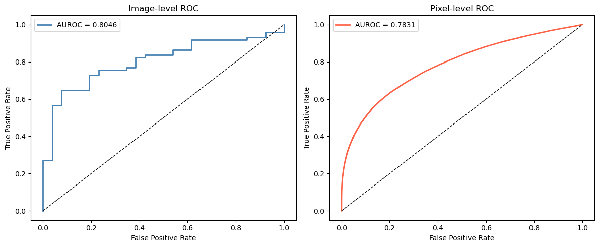
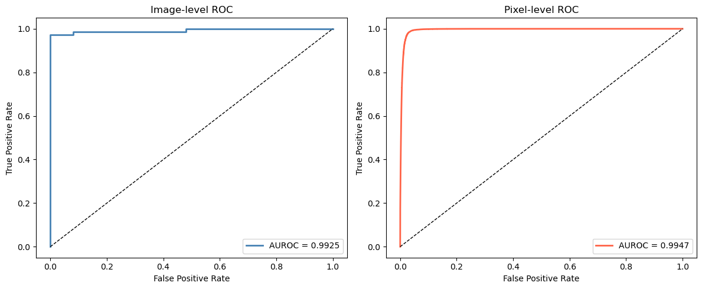

# Visual Quality Control for Manufacturing Defects
Unsupervised anomaly detection on industrial textures.

  

---

---
## Problem Statement
Visual quality control is one of the most common applications of computer vision in manufacturing. A camera inspects items on a production line and flags defective ones before they can reach a customer. A well-run factory produces mostly good parts, therefore defects samples are rare and (possibly) highly different from one another, making supervised learning challenging.

To address this constraint, this project leverages unsupervised learning to build a model what a good part is using only normal samples and uses it at inference time to detect anomalies by identifying samples that deviate from the learned model, either in pixel space (AutoEncoder) or in feature space (PatchCore)
---
## Dataset
The **MVTec Anomaly Detection** dataset is a benchmark for unsupervised defect detection containing 15 categories of industrial objects and textures.

This project focuses on the **leather** category.

The dataset can be found at the following link: https://www.mvtec.com/research-teaching/datasets/mvtec-ad 

After download, the dataset should be structured like this: 

```
dataset/
└── leather/
    ├── train/
    │   └── good/
    ├── test/
    │   ├── good/
    │   ├── color/
    │   ├── cut/
    │   ├── fold/
    │   ├── glue/
    │   └── poke/
    └── ground_truth/
        ├── color/
        ├── cut/
        ├── fold/
        ├── glue/
        └── poke/   
```
---
## Approach

### 1) Autoencoder

The autoencoder is trained to reconstruct input images. Since it is only trained on normal data, it should fail to reconstruct anomalies, resulting in high reconstruction error.

**Architecture:** 4 level convolutional encoder-decoder with a 512-dimensional dense bottleneck. Downsampling and upsampling use stride-2 convolutions with kernel size 4 to avoid checkerboard artifacts. The output activation is Tanh to match the range of ImageNet normalized inputs.

**Loss**: a weighted combination of MSE (for raw pixel-wise differences) and SSIM (for structural and texture differences) (0.4* MSE +0.6 * SSIM)

**Anomaly Scoring:** The image level score is the maximum value of the per-pixel reconstruction error map.

**Known limitations:** The architecture is prone to overfitting. Due to the limited amount of computational resources, no regularization technique was tested, resulting in subpar reconstruction performances. This leads error map to contain high error values even against normal images, making it harder to accurately differentiate between good and bad samples, especially for subtle anomalies such as small color errors.

---
### 2) PatchCore
PatchCore takes advantage of a pretrained model to learn the feature representation of normal samples. 

**Feature Extraction Architecture:** A pretrained (ImageNet) ResNet18 model is used as a fixed feature extractor. Features are extracted from '*layer2*', producing a [128, 32, 32] feature map for each image. Each feature vector is stored in a 'Memory Bank' (~200k vectors).

**Coreset Subsampling:** The memory bank is subsampled to 10% of its original size using a greedy coreset algorithm, maximizing coverage of the entire represented feature space. This ensures that rare but normal patches are present in the coreset.

**Anonaly Scoring:** During inference, the features of a new image are computed and each of the 32x32 vectors are compared to the coreset, computing the distance from the nearest neighbour, producing a spatial anomaly map. The map is then upsampled to the original image dimension for visualization. 

---
## Results

Both the training set (only good samples) and test set (both good and defective samples) were split 80/20 to obtain two validation sets used to tune hyperparameters.

Both models were then tested on the same test set.

| Method | Image AUROC | Pixel AUROC |
| --- | --- | --- |
| Autoencoder | 0.8046 | 0.7831 |
| PatchCore | 0.9925 | 0.9947 |

ROC curves:

**Autoencoder**



**PatchCore**:


---

## Project Structure

```
.
├── dataset/
│   └── ...                             # MVTec dataset
├── models/
│   ├── autoencoder_leather_b512.pth    # Saved autoencoder weights
│   └── patchcore_leather.pth           # Saved coreset + memory bank
├── PatchCore_train.ipynb               #
├── autoencoder_train.ipynb             # Both models implementations, training loops and evaluations
├── main.py                             # Gradio interface
├── README.md
├── environment.yaml
├── .gitignore
├── assets                              
└── 
```

---
## Installation

```bash
# Clone the repo
git clone https://github.com/MarcoCostato/VisualQualityControl4ManufactoringDefects
cd VisualQualiryControl4ManufactoringDefects

# Create conda environment using the environment.yml file

conda create --file environment.yml
conda activate VisualQualityControl
```
---

## Run the Gradio Demo

To run the Gradio demo:

```bash
python main.py
```

Then open [http://localhost:7860](http://localhost:7860) in your browser.

---
## Imortant Notes

Due to github size limitations, the models are not directly downloadable through the repo.

The pipeline is currently trained and evaluated on the leather category only. Extending to all 15 MVTec category with per-category models was unfeasable due to computational constraints

## References

 
- Roth, K. et al. (2022). *Towards Total Recall in Industrial Anomaly Detection*. CVPR 2022. [arXiv:2106.08265](https://arxiv.org/abs/2106.08265)
- Bergmann, P. et al. (2019). *MVTec AD — A Comprehensive Real-World Dataset for Unsupervised Anomaly Detection*. CVPR 2019.
- Wang, Z. et al. (2004). *Image Quality Assessment: From Error Visibility to Structural Similarity*. IEEE Transactions on Image Processing.


